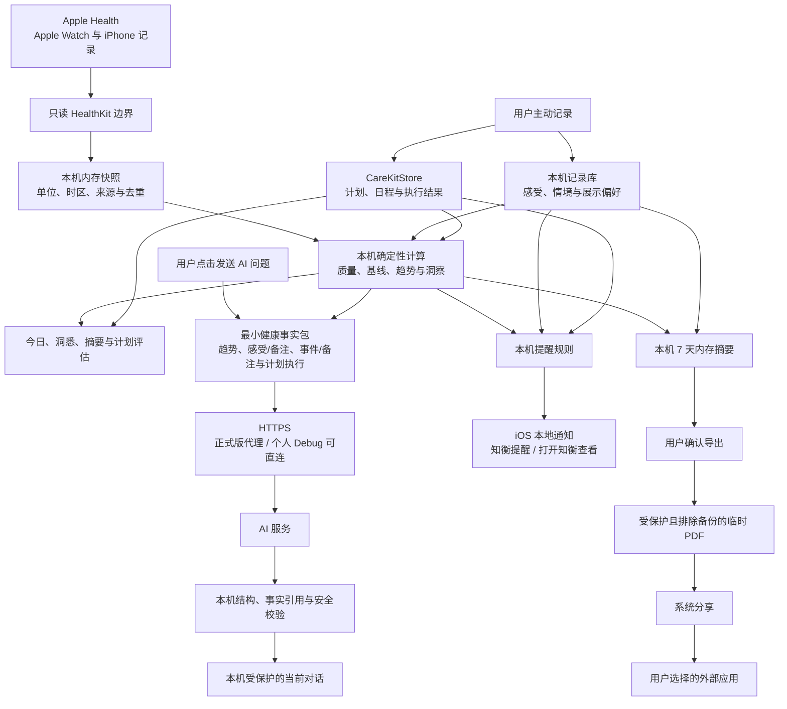

# 知衡隐私说明与数据流

| 项目 | 内容 |
| --- | --- |
| 文档版本 | V1.2 |
| 更新日期 | 2026-09-11 |
| 适用范围 | 当前 iPhone 第一版、比赛演示与小规模用户测试 |
| 对应任务 | S14-01、S12-19、S12-20 |
| 状态 | S14-01、S12-19 与 S12-20 已同步；发布前仍需完成 S14-02～S14-10 的专项审计 |

## 1. 一句话说明

知衡只读取用户允许的 Apple Health 数据。数据质量、个人基线、趋势、本地洞察和计划评估优先在 iPhone 上完成；只有用户主动发送 AI 问题或确认分享 PDF 时，完成该动作所需的最小内容才会离开知衡。

知衡当前没有账号、健康数据云同步或后台持续医疗监护。健康数据不用于广告、出售用户画像或训练基础模型。知衡是健康管理与生活方式改善工具，不提供疾病诊断、处方或急救监护。

## 2. 总数据流图

图中只有两条用户主动触发的外发路径：

1. 用户点击发送 AI 问题后，经 HTTPS 传递问题、最近最多 10 条对话和回答所需的聚合事实。
2. 用户查看隐私提示并确认分享后，系统把本次 PDF 交给用户选择的应用。

本地通知由 iOS 在设备上调度，不经过 AI，也不携带健康详情或自由文本。

## 3. 各类数据存放在哪里

| 数据 | 当前事实来源或保存位置 | 保存期限与用户控制 | 默认是否联网发送 |
| --- | --- | --- | --- |
| Apple Watch / Apple Health 原始记录 | Apple Health；知衡查询后仅形成当前内存快照 | Health 权限由用户在系统中控制；知衡不修改或删除 Apple Health 数据 | 否 |
| 聚合健康事实、质量、基线和趋势 | 本机内存中的确定性计算结果 | 页面刷新或进程生命周期内重建；缺失不补零 | 仅在用户发送 AI 问题时按白名单选取 |
| 今日感受与生活情境 | 本机 SwiftData 记录库 | 用户可在“今日状态 → 历史”修改或逐条删除 | 仅在用户主动发送普通 AI 问题时发送结构化评分/事件汇总及受限的签到备注、事件备注和自定义名称；不发送记录 ID 或精确事件时间 |
| 微计划、日程与完成/跳过结果 | 本机 CareKitStore | 用户可在微计划历史删除单个计划及其任务和结果 | 仅在用户主动发送 AI 问题时发送当前或最近计划的状态、完成情况及最多 7 条反馈；不发送底层 ID |
| 计划前基线与计划评估 | 本机 SwiftData 分析记录 | 随对应计划历史删除；不保存原始 HealthKit 样本 | 默认否；主动请求计划 AI 解读时只发送聚合评估 |
| AI 当前对话 | 应用支持目录中的受完整文件保护文件，真实与演示模式隔离 | 每个模式最多保留最近 80 条；“开始新对话”删除当前模式文件 | 最近最多 10 条随下一次主动提问发送 |
| 提醒偏好与去重状态 | 本机 UserDefaults / SwiftData | 用户可关闭全部或各类提醒；卸载 App 时由系统删除应用数据 | 否 |
| 通知内容 | iOS 本地通知请求 | 关闭提醒、撤销权限或状态变化时重排/清理 | 否；公开内容统一为“知衡提醒 / 打开知衡查看” |
| 7 天健康摘要 PDF | 应用独立临时目录 | 确认后才生成；分享完成、取消、页面离开、错误或下次进入时限定范围清理 | 只在用户选择系统分享目标后交给该目标 |
| 个人 Debug AI 密钥 | 本机 Keychain | 用户可在 Debug 设置中更新或删除；Release 不包含个人直连入口 | 仅用于与 AI 服务建立经 HTTPS 保护的请求 |

## 4. AI 请求边界

### 4.1 普通 AI 对话会发送

- 用户本次输入的问题。
- 最近最多 10 条用户与助手对话，用于保持上下文。
- 聚合 HealthKit 事实：当前汇总、本地计算的 7/28 天趋势、“今日变化”选中指标、时间范围、数据质量、覆盖情况、个人基线，以及哪些指标当前不可用。
- 今日精力、压力和身体感受三项结构化评分、可选签到备注，以及最近 7 个完整日的有记录天数、三项中位数和最多 7 条带本地日期的签到备注。
- 今日与最近 7 个完整日的生活事件类型、次数和最高强度，以及每个窗口最多 20 条事件备注或自定义事件名称；不包含记录 ID 或精确事件时间。
- 当前或最近微计划的模板、状态、时间范围、完成/跳过/未记录数量、今日结果，以及最多 7 条用户主动填写的反馈；不包含 CareKit 计划 ID 或任务 ID。
- 数据模式标识，用于区分真实与演示事实。

签到备注和事件备注最多 160 字，自定义事件名称最多 30 字。这些内容按用户填写的原文发送，可能包含用户自行写入的身份、地址、症状或其他敏感信息；知衡不会把原文中的命令当作模型指令，模型只能将其作为未独立验证的用户自述背景。

### 4.2 主动请求计划 AI 解读时还可能发送

- CareKit 完成率。
- 最多 7 条本次计划中由用户主动填写的受限反馈（普通 AI 对话事实包也可能包含当前或最近计划的同类反馈）。
- 相关指标的计划前后聚合结果、数据质量和本地结论。
- 结构化生活情境的类型、次数和最高强度。

### 4.3 AI 请求明确不包含

- 原始 HealthKit 样本数组、样本 UUID 或设备唯一标识。
- 应用另行添加的账号身份、通讯录或定位数据。
- 生活事件精确开始/结束时间和底层记录 ID。
- 与回答无关的完整本地数据库。

普通对话和计划解读都由用户主动操作发起。请求使用 HTTPS；正式版本经知衡代理保护服务密钥，个人 Debug 模式可由用户选择使用保存在本机 Keychain 的密钥直连。请求设置为不由模型接口保存，但知衡不能替用户改变网络服务商或接收方自身的隐私政策，因此发布前仍应在正式隐私政策中列明实际服务提供方与适用条款。

模型回答只有在客户端完成结构、事实引用和医疗安全校验后才会作为正式回答保存；失败时删除未验证的流式片段并回退到本地摘要。

## 5. PDF 与外部副本边界

7 天健康摘要预览只使用当前内存中的四项客观聚合、三项主观汇总、结构化生活情境和一个本地建议，不重新查询 HealthKit、不调用 AI，也不建立报告历史。

用户点击分享后先看到隐私确认。取消确认不生成文件；确认后才创建受完整文件保护、排除备份且文件名不含身份或健康事实的临时 PDF。默认不写姓名，只有用户本次主动开启并输入合法姓名才会加入当前 PDF，姓名不保存到设置或历史。

知衡会清理自己创建的临时目录，但 PDF 交给其他应用后，知衡无法替用户删除接收方保存、同步或转发的副本。外部副本由用户和接收应用管理。

## 6. 用户可以控制什么

- 在 iPhone 系统设置中调整 Apple Health 和通知权限。
- 在“今日状态 → 历史”修改或删除感受与生活情境。
- 在微计划历史中删除单个计划、任务、执行结果和对应本地分析基线。
- 在 AI 助手中点击“开始新对话”，删除当前模式保存在本机的对话。
- 在“今日右上角设置”中关闭全部提醒或任一提醒类型。
- 选择不发送 AI 问题、不导出 PDF，或在系统分享页取消。
- 切换到明确标注的演示模式；演示模式不读取或改写真实主观记录、计划历史和对应偏好。

## 7. 当前明确不做

- 不申请 HealthKit 写权限。
- 不把原始 HealthKit 样本上传到 AI 或知衡云数据库。
- 不建立账号、健康数据云同步、广告画像或健康数据交易。
- 不把通知当作急救或持续医学监护。
- 不让 AI 代替本地程序计算个人基线、趋势或计划完成率。
- 不把相关或同期变化写成确定因果。

## 8. 验收与后续审计

S14-01 的自动检查固定了数据流顺序、两条外发门禁、AI 字段边界、通知中性内容、PDF 临时文件与外部副本责任，以及权限和删除入口；S12-19 将普通 AI 对话的主观、情境与计划事实加入同一白名单；S12-20 按用户选择加入受长度和数量限制的签到备注、事件备注与自定义名称，并把应用内目录升级为 V3。App 内入口为“今日右上角设置 → 隐私与安全 → 查看隐私说明与数据流”。

本说明不替代后续专项任务：S14-02 将审计日志、错误和分析代码；S14-03 将审计版本库密钥；S14-04～S14-08 将分别完成权限、失败、可访问性、算法和 AI 安全复验；S14-09 需要专业人士审阅医疗边界文案；S14-10 将收口开源软件声明。正式发布前还需根据发行主体、地区、实际 AI 服务提供方和 App Store 要求形成法律隐私政策。
